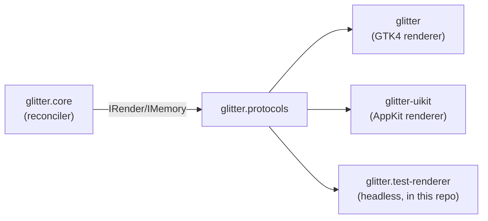

# Architecture

This page covers why `glitter-core` exists as its own repository, what
it contains, and the one seam that makes the whole split possible.

## The `IRender`/`IMemory` seam

`glitter.core`'s reconciler never touches a toolkit directly. Every
mutation — create a node, set an attribute, mount a child, remove a
handler — goes through the `IRender`/`IMemory` protocols
(`glitter.protocols`). A renderer implements those two protocols against
whatever it targets:

`glitter.core` has no idea which of those three (or a future UIKit
renderer) is on the other side. That's what makes the extraction
possible at all: the reconciler was already toolkit-agnostic in design,
it just used to live in the same repository as one specific
implementation of the seam.

## Why the split happened

Jolt inherits a dependency's declared natives transitively, and
hard-fails in its native-loading step before any namespace loads if one
of those natives is missing. `glitter` (the GTK4 renderer) declares
`:jolt/native` for `glib-2.0`, `gobject-2.0`, `gio-2.0`, and `gtk-4`. A
consumer like `glitter-uikit` — an AppKit renderer that never calls a
single GTK function — still had to have GTK4 installed just to load
`glitter.core`, because that namespace lived in the same package as the
native declarations.

Extracting `glitter.core` (and everything it depends on) into a
separate package with zero `:jolt/native` entries fixes that
completely: a consumer can depend on `glitter-core` alone and never
install GTK4.

## What's in this package

- `glitter.core` — the reconciler itself (`reconcile`, diffing, mount/
  unmount lifecycle).
- `glitter.protocols` — the `IRender`/`IMemory` protocol definitions.
- `glitter.hiccup`, `glitter.hiccup-headers` — hiccup parsing.
- `glitter.vdom` — the virtual-DOM tree representation.
- `glitter.alias` — Replicant-style aliases (component-like
  reusable view fragments via a qualified-keyword tag).
- `glitter.errors`, `glitter.assert`, `glitter.asserts` — error
  handling and development-time assertions.
- `glitter.console-logger` — a pluggable logging sink.
- `glitter.env` — Jolt/GTK-specific environment detection (not a
  toolkit-agnostic file, but small enough that extracting it separately
  wasn't worth the ceremony).
- `glitter.test-renderer` — a headless, in-memory `IRender`/`IMemory`
  implementation. Consuming apps can require this directly in their own
  test suites instead of writing a fake from scratch.
- `glitter.nexus.action-log` — an accumulator that records dispatched
  actions and their effects for inspection/debugging. Depends on
  [`nexus-jolt`](https://github.com/jlt-commons/nexus-jolt)'s
  `nexus.core` in its test suite only (a real dispatch exercised
  against the interceptor mechanism, not a mock).

## What's deliberately NOT here

Anything that touches a real toolkit. `glitter.gtk`, `glitter.widget`,
`glitter.ffi`, `glitter.genum`, and `glitter.app` stay in `glitter`
itself — those are the GTK4 renderer. `glitter-uikit` supplies the
equivalent AppKit-facing code in its own repository. Neither renderer's
code was ever a candidate for this extraction; only the toolkit-agnostic
reconciler was.

See [Contributing](contributing.md) for the provenance rules governing
changes to ported code, and this repo's `NOTICE` file for the complete,
file-by-file record of what came from where.
